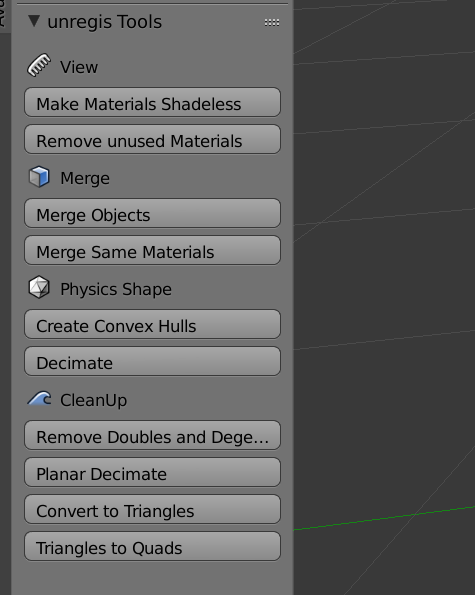
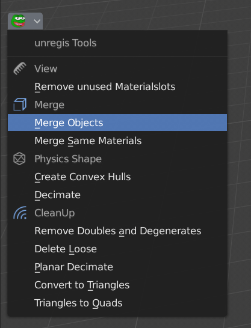

# unregis Tools
Blender AddOn and script (does the same thing as the AddOn) for optimizing and simplfying meshes for blender for use in OpenSim and SL.
## Blender 2.7x

## Blender 2.80

## What do the buttons do

- Make Materials Shadeless
Sets all materials to shadeless for the sole purpose to see all details in Material view
- Remove unused Materials
Removes materials that do not get used (same thing happenes if you save a file and open it again)
- Remove unused Materialslots
Removes Materialslots from selected objects that are not assigned to any faces

- Merge Objects:
Join all selected object with preserving of the UVmaps
- Merge Same Materials:
Merge Materialslots in the selected object together that use the same texture

- Create Convex Hulls:
Convert all objects selected to convex hulls, deleting their materials
- Decimate:
Applies Collapse Decimate Modifier to all selected objects

- Remove Doubles and Degenerates:
Does said thing in all selected objects
- Delete Loose:
Does said thing (+removing loose triangles) in all selected objects
- Planar Decimate:
Applies Planar Decimate Modifier to all selected objects, giving you the option to change the max angle
- Convert to Triangles:
Does said thing in all selected objects
- Triangles to Quads:
Does said thing in all selected objects

## Installation

1. Download [unregis-blender-tools-master.zip](https://github.com/uriesk/unregis-blender-tools/archive/master.zip)
2. Open Blender
3. Go to File -> User Preferences -> Add-Ons (or Edit-> Preferences -> Add-Ons in Blender 2.80)
4. Click on "Install Add-on from file" and select the downloaded zip-file
5. Check the checkbox on the new appearing "Mesh:unregis AddOn" to activate it
5. Now you have new buttons in the 3d view when in object mode

## Caveats about SL/OpenSim

- In SL one material is one "face" and one object can have 8 faces max. The less objects the better.

- The link order is determinded by the order in the collada file (select "sort by object name" on collada export, or you will get a random order).

- No n-gons allowed, Make sure the mesh consists only of tris and quads (to make sure of that, first convert the mesh to tris and then use the tris-to-quads function - the tris-to-quad function alone would leave n-gons around if its not able to make a quad out of it).

- LOD models have to use the same amounts of materials as the original model.

- When generating LODs by the Uploader, it will create degenerate triangles with 0 area for some materials that it would have removed otherwise.
This means that using the LOD model as physics model is discouraged, because degenerate triangles are bad for physics.

- The Analyze button in the Physics tab, that is supposed to create a optimized convex shape out of the physics shape, generates Havok specific meshes that are unusable in other environments like OpenSim.

- Creating an own physics shape (with shapes being convex if possible) is recommended. The smallest possible useful physics shape would therefor be one convex hull shape per object that is decimated to 4 triangles (smallest possible manifold object). Having a good physics shape solves lots of random weird upload failures.

- Worn rigged mesh is displayed differently by viewers than unrigged mesh. The Low and Lowest LOD levels of rigged mesh never gets shown, so those can be 0 without problems.

- Prims created in SL/OpenSim have more polygons than they appear to have. A cube in SL has 48 triangles. This is due to the fact that they can be cut, twisted, hollow, and modified in other ways. Additionally to this, they do not have LOD models. A cube in SL has therefor the exact same complexity as a mesh with 48 faces on all LOD levels — this means that by simply exporting as collada -> uploading it again, you can drastically reduce their complexity, without ever opening them in Blender, by choosing different LoD levels — to merge triangles, open it in Blender -> Slect all -> Remove Doubles and Degenerates -> Planar Decimate and a cube of 48 triangles has now 12 (2 triangles per side)

- Physics shape get scaled up to fit the bounding box of the object. Note: This doesn't mean that the Physics Shape can not be smaller than the original object, it just means that it will be scaled to have the same height and width.

- Setting an object on Phantom does not deactivate it's physics. Collisions still get calculated and collision events still fire. Setting physics shape to None is the only way to deactive it, and this is just possible on child prims.

- When using textures with transparencies, set them on Alpha Mode masking after uploading wherever possible. Default alpha mode blending is havier on resources and multiple alpha-blending textures beneath each other tend to produce glitches (the order of the textures gets wrong, i.e. a worn hair causes your top to disappear wherever it overlapses)

- Transparency set to 100% is better than using a transparent texture -> a transparent texture with alpha mode masking is better than a transparent texture with alpha mode blending

- if you still have to use multiple alpha mode blending textures beneath each other, you can avoid alpha glitches by putting an additional layer between, making it have a transparent texture and setting this to alpha mode masking (mesh bodies with onion layers do that)

- triangles that are invisible because they are inside another shape or completely behind another object and not seen by the viewer are less heavy on calculations than one that's seen. Therefore the pure triangle count is not an indicator of how much lag the mesh is causing.

- GPUs do not know quads or n-gons, they only know triangles and convert polygons to triangles if needed. Shapes consisting of quads do not use less resources than shapes consisting of just triangles, but they use less disk space and less bandwidth
